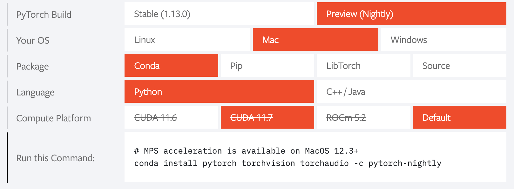

### 如何在docker-compose容器集群中使用nvidia gpu

##### 作者：zyh-hehe

1. 创建云服务器，**并安装好cuda、驱动等**。

2. 安装docker（以centos7为例）：

   ```shell
   curl -fsSL https://get.docker.com | bash -s docker --mirror Aliyun
   ```

3. 安装docker-compose：（版本可以更改，但不能低于1.19。此处选用1.29.1）

   ```shell
   curl -L https://get.daocloud.io/docker/compose/releases/download/1.29.1/docker-compose-`uname -s`-`uname -m` > /usr/local/bin/docker-compose
   
   # 给docker compose 目录授权
   sudo chmod +x /usr/local/bin/docker-compose
   
   # 查看一下version，显示有版本号那就说明安装成功了
   docker-compose version
   ```

4. 安装nvidia-container-runtime:

   ```shell
   # 首先换源，此处以centos7为例。据说ubuntu不用换，直接装就行，我也不清楚
   distribution=$(. /etc/os-release;echo $ID$VERSION_ID)
   
   curl -s -L https://nvidia.github.io/nvidia-container-runtime/$distribution/nvidia-container-runtime.repo | sudo tee /etc/yum.repos.d/nvidia-container-runtime.repo
   
   # 安装nvidia-container-runtime
   sudo yum install nvidia-container-runtime
   ```

5. 在 /etc/docker下修改daemon.json（没有自己创建即可），插入以下内容：

   ```json
   {
    "runtimes": {
           "nvidia": {
               "path": "/usr/bin/nvidia-container-runtime",
               "runtimeArgs": []
            }
       },
    "registry-mirrors": ["https://registry.docker-cn.com"]
   }
   ```

5. 重载daemon文件并重启docker：

   ```shell
   sudo systemctl daemon-reload
   sudo systemctl restart docker
   ```

6. 以单容器方式启动docker with gpu：

   ```shell
   # 此处以一个centos镜像为例
   # --gpus后接all代表使用所有设备，你也可以手动指定使用的卡
   # 这里要求docker版本高于1.19
   docker run --gpus all --name test -d -t centos
   # 进入该容器
   docker exec -it test /bin/bash
   # 使用nvidia-smi测试是否能使用gpu
   nvidia-smi
   ```

7. 在docker-compose集群中使用gpu：

   此处我使用了bitnami提供的docker spark镜像，以此来构造一个一主二从的spark分布式集群。

   bitnami是一个开源项目，现已被 VMware 公司收购，其宗旨是简化在个人终端、Kubernetes 和云服务器等环境上的开源软件的部署。其已为 Docker Hub 社区提供了数百个容器镜像方案，其中的 Redis、MongoDB 等热门镜像更是超过了十亿次下载。

   bitnami/spark 镜像也已超过百万次下载，这是一个成熟的 Spark Docker 方案。此外选择它的重要原因是它的文档齐全，且更新频率快。

   首先拉取镜像：

   ```shell
   docker pull bitnami/spark:latest
   ```

   创建一个用于启动docker-compose集群的文件夹，此处为/docker/spark。在这个文件夹中创建一个docker-compose.yml文件，在其中写入集群配置如下。可以看到，本集群是一主二从的配置，你带的动更多也可以加。在每个容器的配置中都引入了runtime: nvidia，并引入了环境变量NVIDIA_VISIBLE_DEVICES=all。其他配置，如spark集群内部通讯网络、使用核心数与内存大小都可以根据机器配置更改。同时，volumes指定了挂载卷，也可以更改。

   ```shell
   version: '1'
   
   services:
     spark:
       image: docker.io/bitnami/spark:latest
       hostname: master
       runtime: nvidia
       environment:
         - SPARK_MODE=master
         - NVIDIA_VISIBLE_DEVICES=all
         - SPARK_RPC_AUTHENTICATION_ENABLED=no
         - SPARK_RPC_ENCRYPTION_ENABLED=no
         - SPARK_LOCAL_STORAGE_ENCRYPTION_ENABLED=no
         - SPARK_SSL_ENABLED=no
       volumes:
         - /docker/spark/share:/opt/share
       ports:
         - '8080:8080'
         - '4040:4040'
     spark-worker-1:
       image: docker.io/bitnami/spark:latest
       hostname: worker1
       runtime: nvidia
       environment:
         - SPARK_MODE=worker
         - NVIDIA_VISIBLE_DEVICES=all
         - SPARK_MASTER_URL=spark://master:7077
         - SPARK_WORKER_MEMORY=4G
         - SPARK_WORKER_CORES=2
         - SPARK_RPC_AUTHENTICATION_ENABLED=no
         - SPARK_RPC_ENCRYPTION_ENABLED=no
         - SPARK_LOCAL_STORAGE_ENCRYPTION_ENABLED=no
         - SPARK_SSL_ENABLED=no
       volumes:
         - /docker/spark/share:/opt/share
       ports:
         - '8081:8081'
     spark-worker-2:
       image: docker.io/bitnami/spark:latest
       hostname: worker2
       runtime: nvidia
       environment:
         - NVIDIA_VISIBLE_DEVICES=all
         - SPARK_MODE=worker
         - SPARK_MASTER_URL=spark://master:7077
         - SPARK_WORKER_MEMORY=4G
         - SPARK_WORKER_CORES=2
         - SPARK_RPC_AUTHENTICATION_ENABLED=no
         - SPARK_RPC_ENCRYPTION_ENABLED=no
         - SPARK_LOCAL_STORAGE_ENCRYPTION_ENABLED=no
         - SPARK_SSL_ENABLED=no
       volumes:
         - /docker/spark/share:/opt/share
       ports:
         - '8082:8081'
   ```

   启动docker-compose：

   ```shell
   docker-compose up -d
   ```

8. 其他

   - 引用和参考的文章包括但不限于：

     https://zhuanlan.zhihu.com/p/421375012

     https://www.hangge.com/blog/cache/detail_3184.html

     https://developer.nvidia.com/blog/gpu-containers-runtime/

     https://blog.csdn.net/u011285477/article/details/103100509

     https://stackoverflow.com/questions/47465696/how-do-i-specify-nvidia-runtime-from-docker-compose-yml

     https://www.cnblogs.com/luckforefforts/p/13642682.html

     https://blog.csdn.net/weixin_44953227/article/details/116901201

   - 你问我为什么在docker里用gpu？好问题，之后可能会在bitnami/spark镜像的基础上打一个装了pytorch的镜像，额，我先睡了。

   - 顺带一提，pytorch预览版适配了Apple Silicon （M1/M1 Pro/M2），可以使用mps进行加速了。安装方式如下：
   
     
   
     使用方式如下：
   
     ```python
     def get_device():
     	if torch.cuda.is_available():
     		return 'cuda'
     	elif getattr(torch.backends,'mps',None) is not None and torch.backends.mps.is_available():
     		return 'mps'
     	else:
     		return 'cpu'
     
     device = get_device()
     print(device)
     # mps
     ```
   
     测评如下：（支持柏油校友）
   
     【PyTorch支持M1 GPU加速了! 提升有多大?】 https://www.bilibili.com/video/BV1a341137Sb/?share_source=copy_web&vd_source=6aa6d9106049fcd69621d5ea626cd885
   
     我也试了试，感觉就图一乐，不如N卡一根——
   
   - 有什么问题欢迎提issue，但这个不会真有人看吧，毕竟只是我的奇怪经历总结